# SSD1306 OLED Displays

If you want to add an inexpensive monochrome display to your project, the SSD1306 displays can be very handy. 

They are available in a few sizes, most commonly the 128x64 pixels 0.96" diagonal:

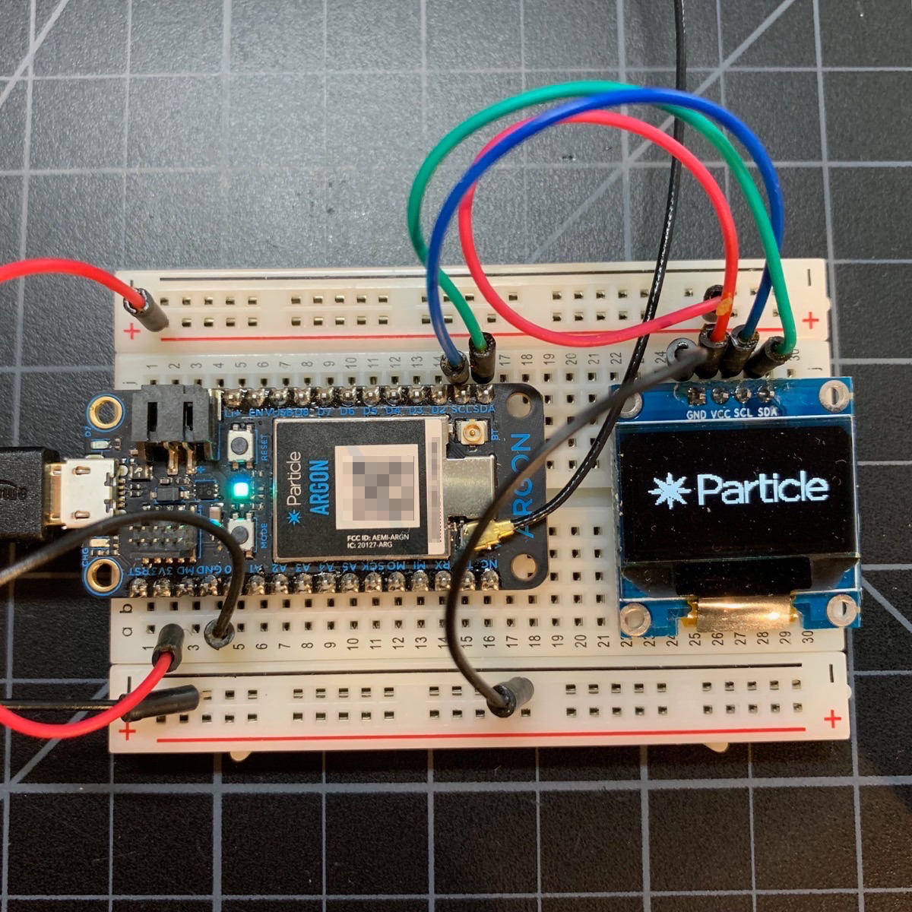

And the 128x32 pixel short display:

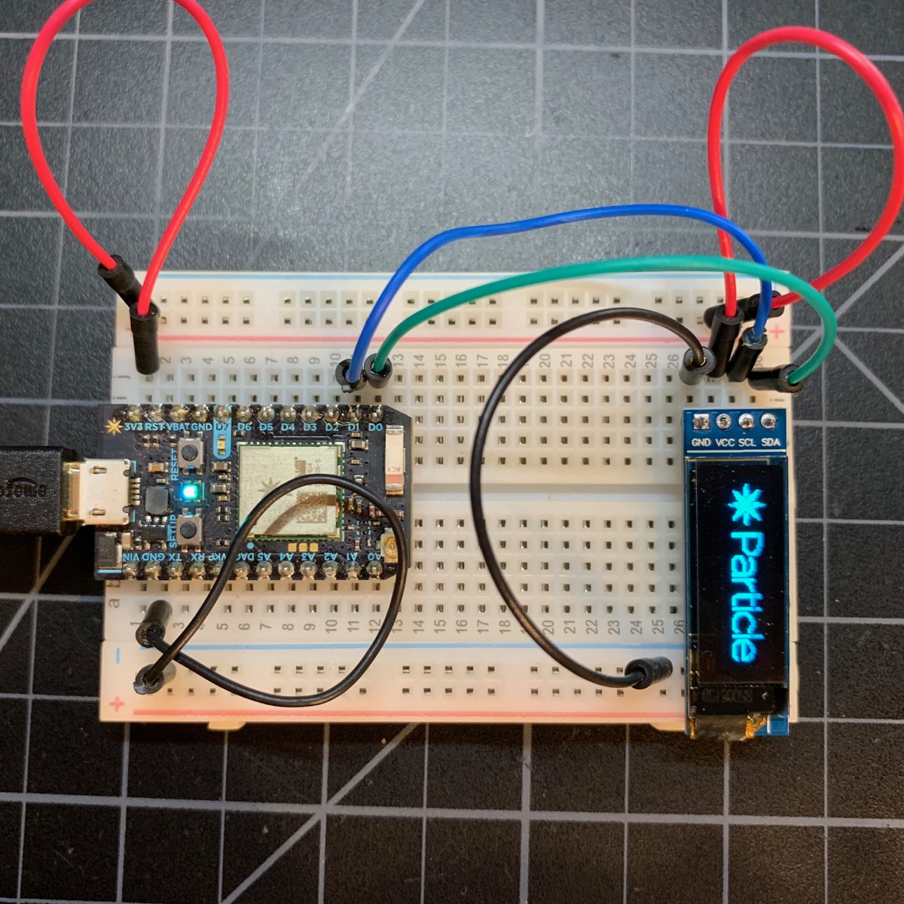

There are two ways you can connect your display to your device: I2C (pins D0 and D1), or SPI. While the SPI interface is a little faster, it requires more pins and there are some caveats if you need to share the SPI interface with other things, like an SD card. I recommend using I2C, but both work.


## Connecting and initializing your display

### Feather

By far the easiest way to use a display is as a FeatherWing in a doubler or tripler. No wires to deal with! The Adafruit display has a 128 x 32 pixel display and 3 small buttons. There's also one with a tiny joystick. The display connects by I2C.

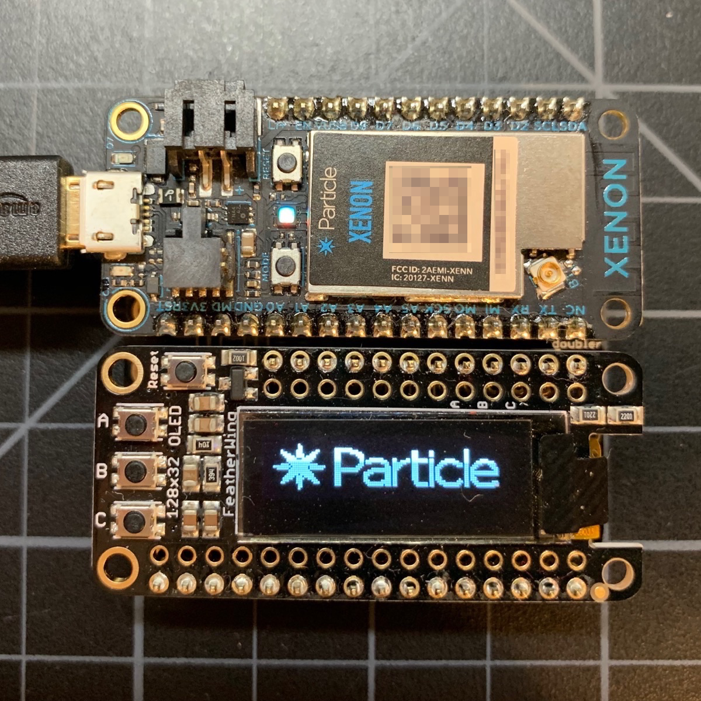

You can purchase one from the [Particle Store](https://store.particle.io/collections/accessories) or from [Adafruit](https://www.adafruit.com/product/2900). You can find more technical information [at Adafruit](https://learn.adafruit.com/adafruit-oled-featherwing/overview).

The object to control the display is typically:

```
Adafruit_SSD1306 display(128, 32, &Wire, -1);
```

And from setup() you call:

```
display.begin(SSD1306_SWITCHCAPVCC, 0x3c);
```

0x3c is typically the the display I2C address.

- The Tripler is available from the [Particle Online Store](https://store.particle.io/products/particle-featherwing-tripler) or [Adafruit](https://www.adafruit.com/product/3417).
- The Doubler is available from [Adafruit](https://www.adafruit.com/product/2890).


### I2C

All devices:

| Display Pin | Device Pin | Color |
| :---: | :---: | --- |
| GND | GND | Black |
| VCC | 3V3 | Red |
| SCL | D1 (SCL) | Blue |
| SDA | D0 (SDA) | Green |


Some I2C displays also have a hardware reset line. The examples use -1 ("no hardware reset line"). If you have extra GPIO and your display has a hardware reset line you can hook it up if you want but it's generally not necessary.

For 128x64 displays (white, blue, or yellow/blue) connected by I2C to D0/D1, you create a display object like this:

```
Adafruit_SSD1306 display(128, 64, &Wire, -1);
```

From setup(), call:

```
display.begin(SSD1306_SWITCHCAPVCC, 0x3c);
```

0x3c is typically the the display I2C address. On some displays it is 0x3d. You can find out from the datasheet or using the [I2C scanner](https://docs.particle.io/support/particle-devices-faq/i2c-faq/#i2c-scanner).

For the 128x32 (short) displays (white or blue) connected by I2C to D0/D1:

```
Adafruit_SSD1306 display(128, 32, &Wire, -1);
```

On the Xenon and Argon, you can also use Wire1 (secondary I2C):

| Display Pin | Device Pin | Color |
| :---: | :---: | --- |
| GND | GND | Black |
| VCC | 3V3 | Red |
| SCL | D3 (SCL) | Blue |
| SDA | D2 (SDA) | Green |

For 128x64 displays (white, blue, or yellow/blue) connected by I2C to D2/D3, you create a display object like this:

```
Adafruit_SSD1306 display(128, 64, &Wire1, -1);
```

- `Wire1` is not available on the Boron, Photon, or P1.
- `Wire1` cannot be used if the Ethernet FeatherWing is used as D3 is used by Ethernet.
- `Wire1` exists on the Electron (on pins C4 and C5), however it's only an alternate pin mapping, You cannot use both `Wire` and `Wire1` at the same time on the Electron as they're connected to the same hardware I2C port internally. Same for the E Series.


### SPI

The pins on most SPI SSD1306 displays are very confusing, and there are a lot of them, one of the reason I prefer using I2C.

- D0 is a D and a zero, and it's the SPI Clock (SCK), not DO (data output, MISO). 
- In fact there is no data transfer from the display and MISO on the device isn't connected to the display at all.
- D1 is a D and a one, and it's it's MOSI, which is coincidentally also DI (data in).
- RES is the reset pin. It's recommended when using SPI. Any GPIO can be used. If you have multiple displays, you can share the RES line across all displays.
- DC is the data control line. It's required when using SPI mode. If you have multiple displays you can share the DC line across all displays.
- CS is the chip select or SS Line. Any GPIO can be used. If you have multiple displays, each one must have a separate CS. Each SPI device on the same bus must also have a unique CS pin.


Gen 3 (Argon/Boron/Xenon) Devices:

| Display Pin | Device Pin | Color |
| :---: | :---: | --- |
| GND | GND | Black |
| VCC | 3V3 | Red |
| D0 | SCK | Orange |
| D1 | MOSI | Green |
| RES | A5<sup>1</sup> | Yellow | 
| DC | A4<sup>1</sup> | Blue |
| CS | A3<sup>1</sup> | White |

<sup>1</sup> Can use any available GPIO, this is just what's shown in the picture and is used in the example code.

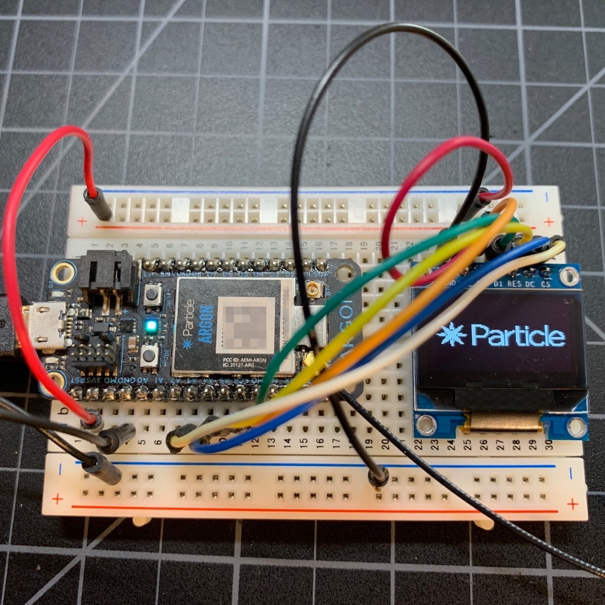

On the Argon and Xenon only (SPI1):

| Display Pin | Device Pin | Color |
| :---: | :---: | --- |
| GND | GND | Black |
| VCC | 3V3 | Red |
| D0 | D2 (SCK) | Orange |
| D1 | D3 (MOSI) | Green |
| RES | D5<sup>1</sup> | Yellow | 
| DC | D6<sup>1</sup> | Blue |
| CS | D8<sup>1</sup> | White |


Gen 2 (Photon/P1/Electron) Devices using Primary SPI (SPI):

| Display Pin | Device Pin | Color |
| :---: | :---: | --- |
| GND | GND | Black |
| VCC | 3V3 | Red |
| D0 | A3 (SCK) | Orange |
| D1 | A5 (MOSI) | Green |
| RES | A0<sup>1</sup> | Yellow | 
| DC | A1<sup>1</sup> | Blue |
| CS | A2<sup>1</sup> | White |

Gen 2 (Photon/P1/Electron) Devices using Secondary SPI (SPI1):

| Display Pin | Device Pin | Color |
| :---: | :---: | --- |
| GND | GND | Black |
| VCC | 3V3 | Red |
| D0 | D4 (SCK) | Orange |
| D1 | D2 (MOSI) | Green |
| RES | A5<sup>1</sup> | Yellow | 
| DC | D6<sup>1</sup> | Blue |
| CS | D5<sup>1</sup> | White |

<sup>1</sup> Can use any available GPIO, this is just what's shown in the picture and is used in the example code.

### Yellow and Blue 

One variation, available for both I2C and SPI versions, is the yellow and blue 128x64 display. It's not a multi-color pixel display. The top 16 rows are yellow, and the bottom 48 rows are blue. You can't change the color of a pixel, you can only turn the pixel on or off.

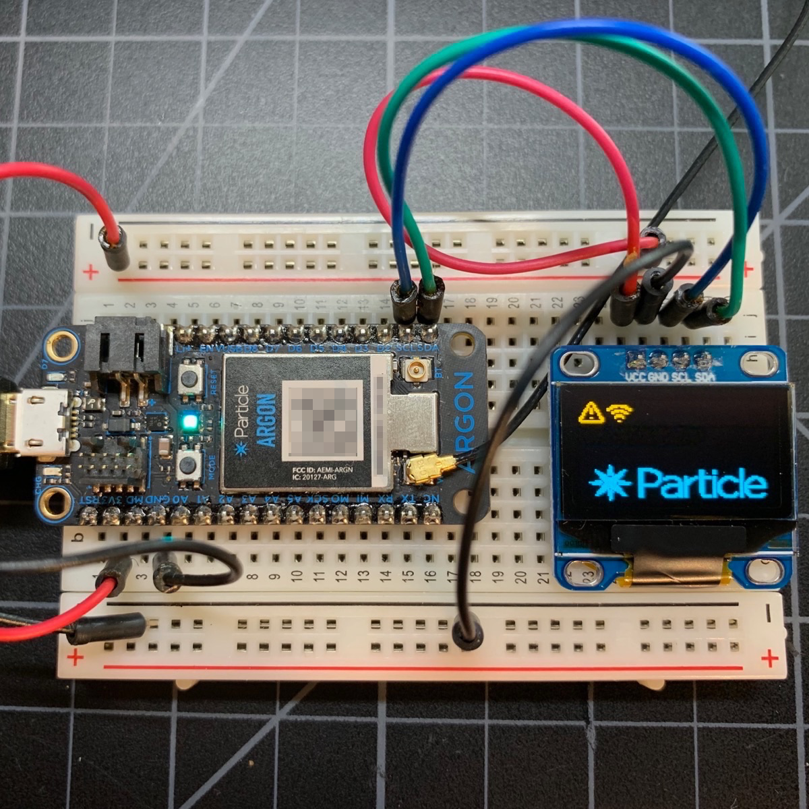

## Using the DisplayGenerator

One thing that's a pain when using these displays is having to write the code, flash it, and keep iterating until you get the display laid out correctly. You can greatly speed up this process by using the web-based DisplayGenerator:

[https://rickkas7.github.io/DisplayGenerator/](https://rickkas7.github.io/DisplayGenerator/)

Chrome is recommended. It should also work in Firefox. It does not work with Edge or Internet Explorer!

It looks like this:

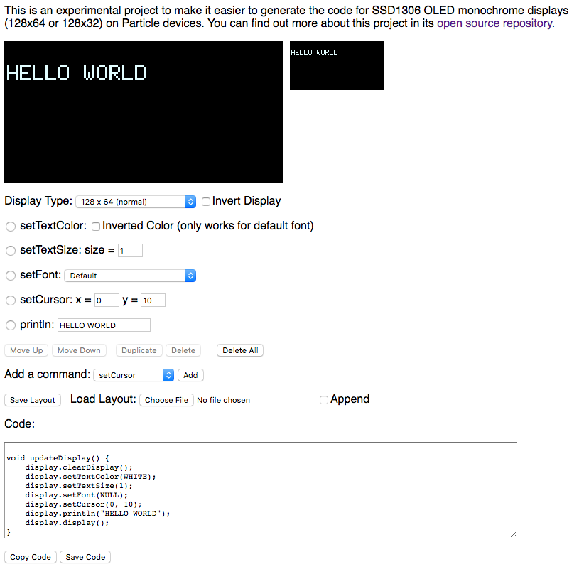

From the top to the bottom:

- A magnified version of the screen and a real-sized version
- Selector for display type:
  - 128x64 (normal)
  - 128x32 (short)
  - 128x64 (yellow and blue)
- Checkbox to show the display in inverted mode
- The commands section, which shows the various display commands (explained below)
- Buttons to move the commands around, duplicate, and delete commands
- A selector to add another command
- Options to save a layout and load a layout if you want to work with it later
- Box with the generated code
- Buttons to Copy the code to the clipboard or save it to a file

The display is coordinate (0, 0) at the upper left and (128, 64) or (128, 32) in the lower right corner depending on the display used.

The display commands include:

- writePixel (x, y, color). Since the SSD1306 is monochrome you typically use color 1.
- drawLine (x0, y0, x1, y1, color). Draws a line from (x0, y0) to (x1, y1).
- drawRect (x, y, w, h, color). Draws a rectangle.
- fillRect (x, y, w, h, color). Draws a rectangle filled with the color (typically 1).
- drawRoundRect (x, y, w, h, r, color). Draws a round corner rectangle with the specific radius.
- fillRoundRect (x, y, w, h, r, color). Draws a round corner rectangle with the specific radius and fill color.
- drawCircle (x, y, r, color). Draws a circle with the center at (x, y), radius, and color.
- fillCircle (x, y, r, color). Draws a filled circle.
- drawTriangle (x0, y0, x1, y1, x2, y2, color). Draws a triangle.
- fillTriangle (x0, y0, x1, y1, x2, y2, color). Draws a filled triangle.
- setCursor (x, y). Used with text drawing.
- setTextColor. Sets the text color to WHITE, the default.
- setTextSize (size). Changes the text size. Is multiples of the base size; 1 is the normal size of the font. 2 is twice the size, each pixel is blow up to 2x2 pixels.
- setTextWrap (w). Whether text wraps when it reaches the right edge. 0 = no wrap, 1 = wrap. Default is no wrap.
- setFont. Sets the font. Each font beyond the default will increase the code size. 
- print. Prints text to the display.
- println. Prints text to the display and moves to the beginning on the next line.
- printCentered. Print text centered on the display. This only centers static text; it just does the measuring for you.
- drawIcon. This has numerous options.

The drawIcon option allows you to create an icon from an uploaded image, a standard icon, or use Adafruit or Particle logos.

- The **Square** option create a square icon of the specified size. 
- Unchecking **Square** allows separate options for width and height
- The **Weight** option controls grayscale conversion and scaling. When an image is scaled, it's anti-aliased with gray edges. The weight determines which of those are converted to white pixels. 
- The **Upload and convert image file** option allow you do upload a png, jpg, gif, etc.
- The **select a standard logo** supports several Particle and Adafruit logos.
- The **select a stock icon from the open source [Feather Icons](https://feathericons.com/)** option allows an icon to be created from over 100 free standard icons.

For example, you can easily make a caution icon. The display generator makes the bitmap definitions and shows the commands you use to display it.

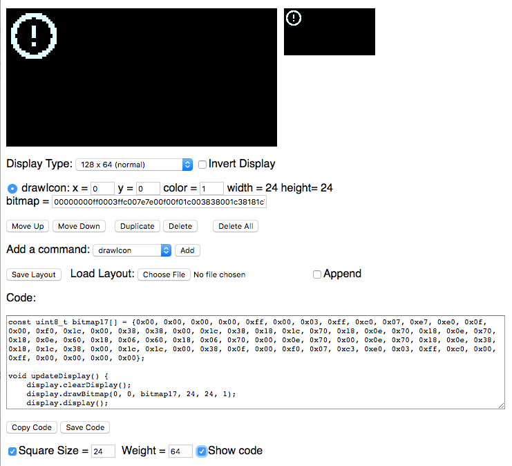


## Using Adafruit GFX 

The SSD1306 displays are programmed using the Adafruit GFX graphics library. The easiest way is to use the Display Generator, but some of the more common commands include:

### Displaying

With the SSD1306 you typically follow the pattern of:

```
display.clearDisplay();

// draw, print text, etc.

display.display();
```

Note that all of the commands below just write to the bitmap stored in RAM. The bitmap is not transferred to the display until you call `display()`. You probably want to do all of your drawing then call `display()` once, since it's relatively slow to transfer the image to the display.

### Fonts

There are a large number of available fonts. They're bitmaps, so they're specific to a particular size, but you can scale it 2x, 3x, ... to make larger text, though it will be pixellated. You'll probably want to minimize the number of fonts each font uses your code flash space. Larger fonts use more space.

In order to use a font you use setFont. You also need to include the font definition by including a specific header file. For example:

```
#include "FreeSans12pt7b.h"
```

To set the font, you use:

```
display.setFont(&FreeSans12pt7b);
```

To change the font scaling you use `setTextSize`. The value of 1 is the normal size of the font, 2 is twice the size (each pixel is output as 2x2), 3 is three times the size (each pixel is output as 3x3), ....

```
display.setTextSize(2);
```

```
// PROTOTYPES
void setTextSize(uint8_t s),
void setTextSize(uint8_t sx, uint8_t sy),
void setFont(const GFXfont *f = NULL);
```

Passing NULL or omitting the parameter to `setFont()` restores the default font.

### Text

To draw text you position the cursor using `setCursor` and use `print` or `println`.

The `print` command prints text at the current cursor position and moves the cursor to after the text. You can use multiple prints to print things left to right.

The `println` command prints text at the current cursor position and moves the cursor to the beginning of the next line.

You can pass string constants, variables, and things you'd normally be able to pass to a String or Serial print command:

```
// PROTOTYPES
size_t print(const char[]);
size_t print(const char*);
size_t print(const String&);

// EXAMPLE
display.print("TESTING");
```

You can pass string constants and things that can be converted to a C string to print and println.

```
// PROTOTYPE
size_t print(char);

// EXAMPLE
display.print('X');
```

You can print a single character, a string constant or a char variable.

```
// PROTOTYPE
size_t print(unsigned char, int = DEC);
display
```

Passing an unsigned char or uint8_t treats the value as a number. By default, it prints in decimal (0-255). It can also be printed as hexadecimal (0-FF), octal (0-277), or binary (00000000-11111111).

```
const unsigned char DEC = 10;
const unsigned char HEX = 16;
const unsigned char OCT = 8;
const unsigned char BIN = 2;
```

```
// PROTOTOTYPES
size_t print(unsigned char, int = DEC);
size_t print(int, int = DEC);
size_t print(unsigned int, int = DEC);
size_t print(long, int = DEC);
size_t print(unsigned long, int = DEC);
```

Other types, both signed and unsigned, can also be printed as a number. If you pass an integer numeric constant it's treated as int.

```
// PROTOTYPE
size_t print(double, int = 2);
```

If you pass a double (or float), it's printed as a decimal number. The second parameter is the number of decimal places to show, the default is 2.

### Shapes

```
// PROTOTYPE
void writePixel(int16_t x, int16_t y, uint16_t color);

// EXAMPLE
display.writePixel(10, 20, 1);
```

Draw a single pixel. With the SSD1306 you will almost always pass 1 for color (white).

The exception is when you've painted an area white, and then want to restore some pixels to black, then use color 0 (black).

Note that even when you're using blue or yellow displays, you still use color 1 (white).

The display is coordinate (0, 0) at the upper left and (128, 64) or (128, 32) in the lower right corner depending on the display used.

```
// PROTOTYPE
void writeLine(int16_t x0, int16_t y0, int16_t x1, int16_t y1, uint16_t color);
```

Draw a line from (x0, y0) to (x1, y1).

```
// PROTOTYPE
void drawRect(int16_t x, int16_t y, int16_t w, int16_t h, uint16_t color);
void fillRect(int16_t x, int16_t y, int16_t w, int16_t h, uint16_t color);
```

Draw a rectangle (border only) or filled rectangle. You specify (x, y) of the upper-left and then the width and height.

```
// PROTOTYPE
void drawRoundRect(int16_t x0, int16_t y0, int16_t w, int16_t h, int16_t radius, uint16_t color);
void fillRoundRect(int16_t x0, int16_t y0, int16_t w, int16_t h, int16_t radius, uint16_t color);
```

Draw a rectangle with rounded corners. You specify (x, y) of the upper-left, the width and height, and the radius of the rounded corners.
      
```
// PROTOTYPE
void drawCircle(int16_t x0, int16_t y0, int16_t r, uint16_t color);
void fillCircle(int16_t x0, int16_t y0, int16_t r, uint16_t color);
```

Draw a circle with (x0, y0) in the center and radius (r).

```
// PROTOTYPE
void drawTriangle(int16_t x0, int16_t y0, int16_t x1, int16_t y1, int16_t x2, int16_t y2, uint16_t color);
void fillTriangle(int16_t x0, int16_t y0, int16_t x1, int16_t y1, int16_t x2, int16_t y2, uint16_t color),
```

Draw a triangle with corners (x0, y0), (x1, y1), and (x2, y2).


### Bitmaps

The easiest way to convert a bitmap is to use the DisplayGenerator, above.

```
// PROTOTYPE
void drawBitmap(int16_t x, int16_t y, const uint8_t bitmap[], int16_t w, int16_t h, uint16_t color);
```

To draw a bitmap, you need the (x, y) of the upper-left, width and height (w, h) and the bitmap data. 


## Advanced techniques


### Multiple displays using SPI

While I previously said that I preferred to use I2C, there is one case where SPI is helpful: multiple displays. Most displays don't have an I2C address selector, so if you want to connect multiple displays you either need multiple I2C busses, or an I2C multiplexer. 

When using multiple SPI displays, D0 (SCK), D1 (MOSI), RESET, and DC can all be shared across all displays.

Each display needs a unique CS line, so you need one additional GPIO for each display you add.

One important thing: Only define the `RESET` line on the first display that you call begin() on! You can see that instead of passing `OLED_RESET` in the `display2` constructor it passes `-1`. This is because if you hardware reset again, the settings on display1 will be cleared and it will no longer work.

```
#define OLED_RESET  A5
#define OLED_DC     A4
#define OLED_CS     A3

#define OLED2_CS     A2

Adafruit_SSD1306 display1(SCREEN_WIDTH, SCREEN_HEIGHT,
		&SPI, OLED_DC, OLED_RESET, OLED_CS);

Adafruit_SSD1306 display2(SCREEN_WIDTH, SCREEN_HEIGHT,
		&SPI, OLED_DC, -1, OLED2_CS);
```

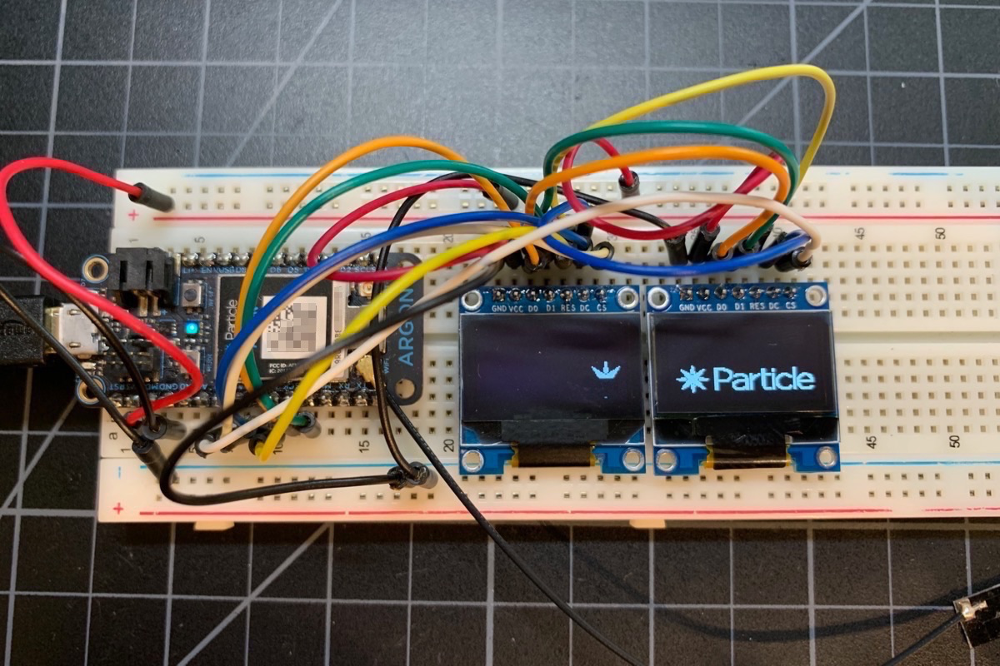

Two works well, even updating the displays every 20 milliseconds. 

<video width="720" height="480" controls >
  <source src="images/bounce-small.mp4" type="video/mp4">
</video>

Using four displays is possible, however it takes about 40 milliseconds to update all four displays, so you can't get the refresh rate of a dual display. But for relatively static displays, it works.

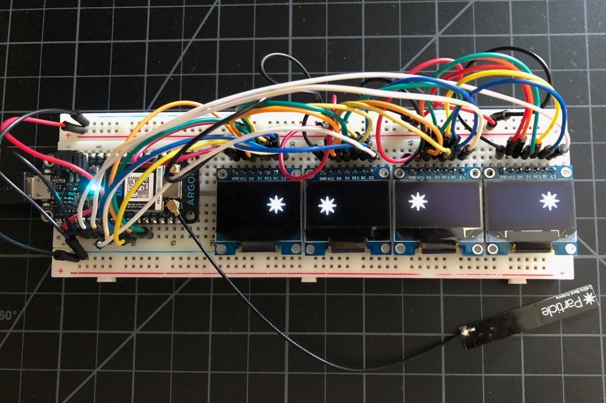

<video width="640" height="360" controls >
  <source src="images/bounce4-480.mp4" type="video/mp4">
</video>


Also, it's an odd use case, but if you need two (or more) displays with exactly the same content, you should use SPI. Just connect both displays with the same CS pin. Because SSD1306 SPI is unidirectional, you can connect multiple displays "in parallel" and have them show the same content. This does not work with I2C because the communication is bidirectional.

### Using multiple displays as a single large display

It is possible to create a virtual display that spans across multiple physical displays. 

<video width="640" height="360" controls >
  <source src="images/span-480.mp4" type="video/mp4">
</video>

In spanning mode, a single virtual display is mapped to multiple physical displays. This 4 display appears as if it is 512 x 64 pixels.

### Pong Demo

The Pong Demo uses two SPI SSD1306 displays for the display unit.

<video width="720" height="480" controls >
  <source src="images/pong.mp4" type="video/mp4">
</video>

It also uses two Xenons with BNO055 accelerometers to control the paddles. They communicate by BLE (bluetooth) to the display unit.

### Making circuit boards with displays

One really important caveat: These displays have a finite lifetime. At a full brightness running all the time, they will become noticeably dimmer after about 2 years. And the displays do occasionally fail.

Because of these two factors, I've taken to putting a standard I2C SSD1306 in a 4-pin female socket instead of directly soldering it to my board. This makes it easy to swap the display.

However, it also makes it unstable, so that required adding some holes and a stand-off to secure the display properly.

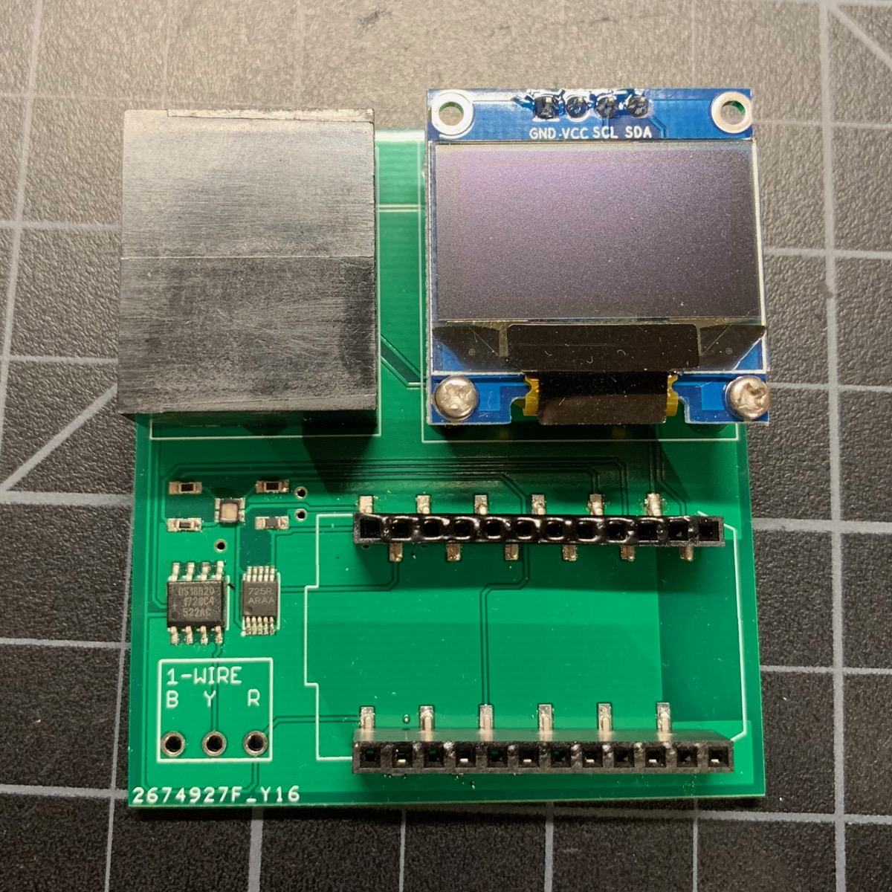


Furthermore, there's another annoying problem: The power pins are not standardized on I2C displays. Sometimes VCC is on the left, sometimes GND is on the left. Some sellers will show the wrong item in the picture.

I eventually decided to just include jumpers. There's plenty of space under the display when you use a female socket. You just put the jumpers on horizontally for VCC on the left, or vertical for GND on the left. Problem solved!

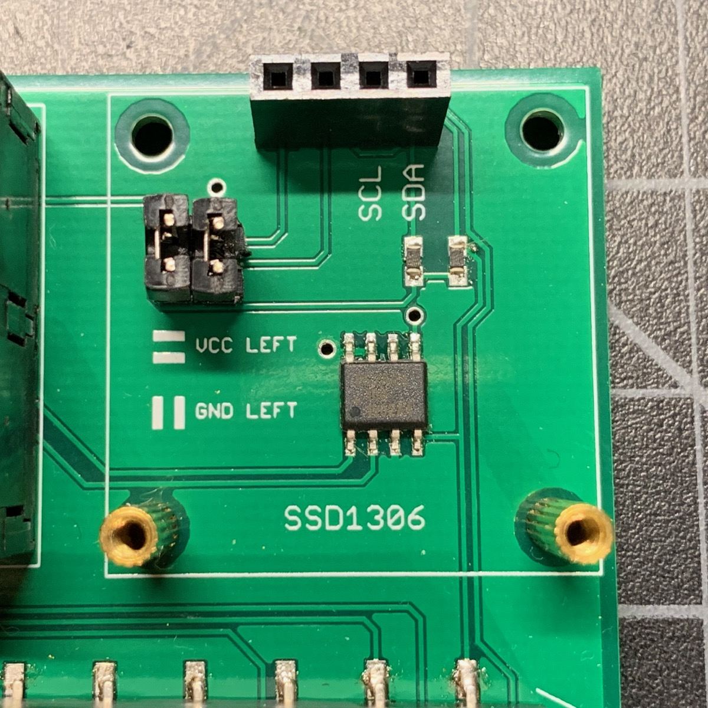

The mounting hardware includes:

| Quan | Item | Example | Price | 
| :--: | :--- | :--- | ---: |
| 1 | 4-pin female header PTH | [Sullins PPTC041LFBN-RC](https://www.digikey.com/product-detail/en/sullins-connector-solutions/PPTC041LFBN-RC/S7002-ND/810144) | $0.45 |
| 2 | 0.1" jumpers | | | 
| 2 | M2 10+3mm standoff | | |
| 2 | M2 nut | | |
| 2 | M2 5mm screw | | |


I've included an Eagle CAD design block in the **eagle** directory in the Github repository. There's a stray outline that I can't figure out how to remove, so once you place the design block, just delete the outline and the design block will correctly merge with the rest of your board.

